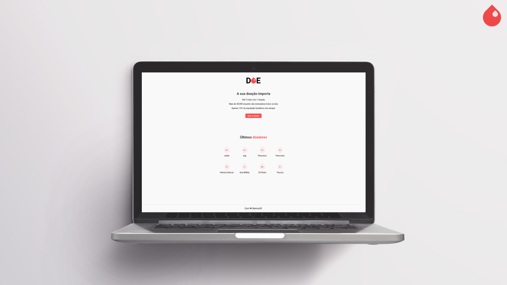
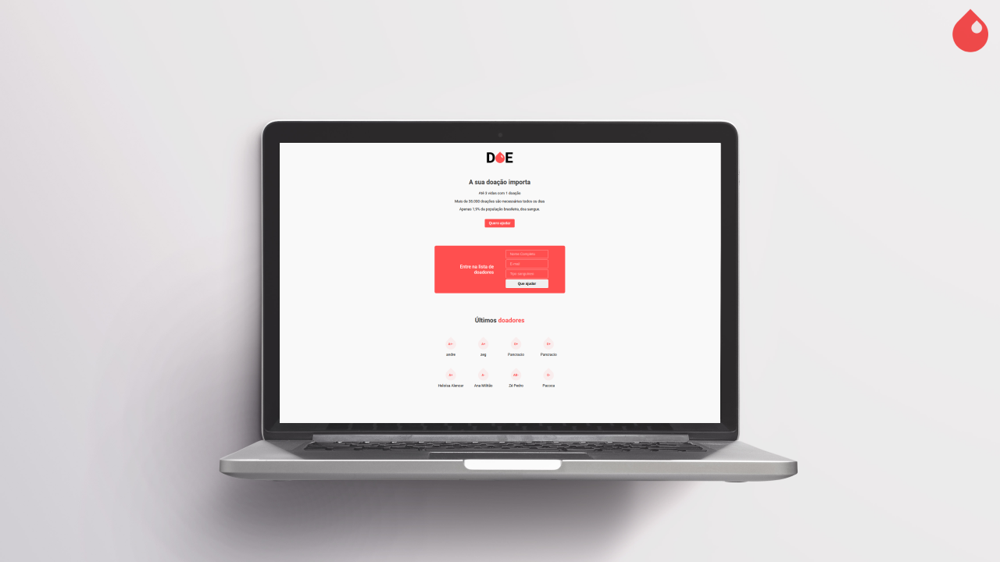

# DOE❤ - Doe Sangue 
> Aplicação Web destinada ao cadastro de pessoas interessadas em doar sangue.
<br>

<div align="center">



</div>
<hr>

<br><br>

<div align="center">


</div>

<br><br>


## A aplicação DOE foi desenvolvido durante a 3ª Edição da MaratonaDev da :rocket: Rocketseat

### Doe é projeto de web-site destinado ao cadastro de pessoas interessadas na doação de sangue.


## :sparkles: Tecnologias

[Node.js](https://nodejs.org/en/)
| [Javascript](https://developer.mozilla.org/pt-BR/docs/Aprender/JavaScript)
| [Html](https://tableless.com.br/o-que-html-basico/)
| [CSS](https://www.w3schools.com/css/)
| [Nodemon](https://nodemon.io/)
| [PostgreSQL](https://www.postgresql.org/)
| [Nunjucks](https://mozilla.github.io/nunjucks/)

<br><hr>

## 💻 Instalação


É necessário ter instalado em seu computador o **Node.js** e o **PostgreSQL** (Caso não tenha algum deles você pode efetuar o download nos links acima.)

Agora usango GIT você efetuará o clone do repositório com o seguinte comando:
(É importande confirmar o diretório em que deseja efetuar o clone)
```sh
git clone https://github.com/Alencar26/Web_Site_Doe_Sangue.git
```

PS: Caso não tenha o GIT instalado em sua máquina, você pode acessar o link abaixo:<br>
 - [GIT](https://git-scm.com/downloads)

Após o download:

1. Abra do diretório do projeto.
2. Na raiz do projeto execute o seguinte comando no terminal:

```sh
npm install
```

3. No PostgreSQL crie um banco de dados chamado "Doe":
```
CREATE DATABASE Doe;
USE Doe;
```
Logo após crie uma tabela chamada de "donors":
```
CREATE TABLE donors(
    id SERIAL NOT NULL,
    name VARCHAR(255) NOT NULL,
    email VARCHAR(255) NOT NULL,
    blood VARCHAR(255) NOT NULL
);
```

4. Execute no terminal. (no diretorio raiz)
```
npm start
```
Isso fará com que o servidor comece a rodar na porta 3000 do seu 127.1.0.0
- Abra o navegar no localhost:
```
http://localhost:3000
```

# LICENCE


Projeto sob licença <a href="./LICENSE">MIT</a> © <A href="https://rocketseat.com.br/">Rocketseat</a>